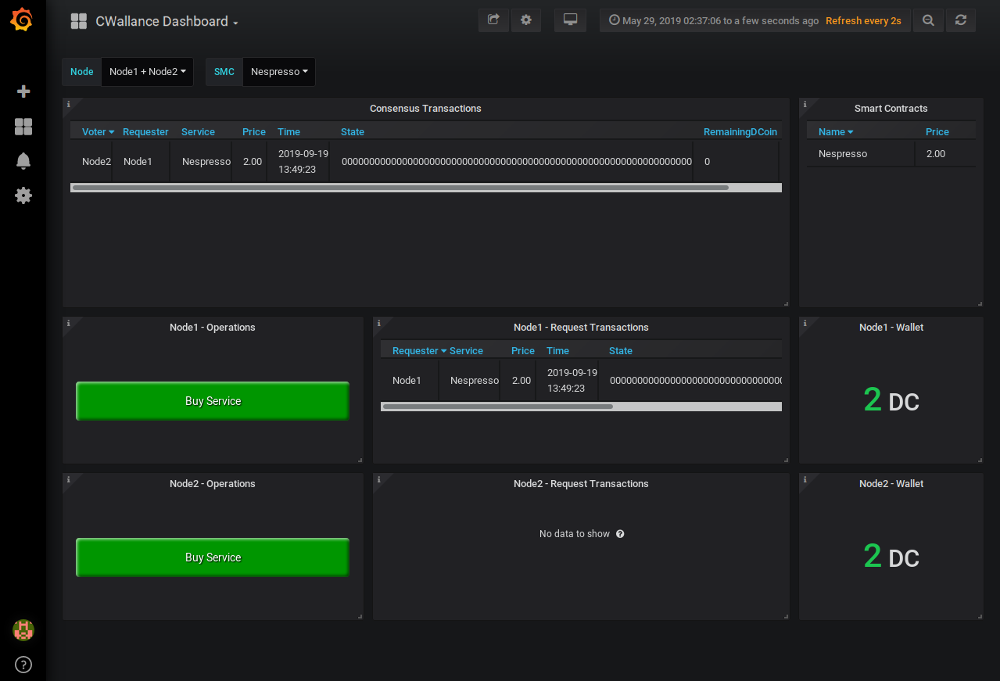

# Wallance, an Alternative to Blockchain for IoT (Tutorial)

## Introduction

We propose a lightweight alternative to blockchain, called *Wallance* to secure interactions in a decentralized IoT infrastructure. Taking into account all its constraints as memory, computing power and energy, our proof of concept promotes the sharing of data and the utilization of services as a real IoT network, in a secure way.

In this tutorial, we will install step by step *CWallance* Node (on Raspberry Pi3 Model B+) and *CWallance* User Interface (on PC) based on Grafana. A complete description of our protocol is available on our paper "*Wallance, an Alternative to Blockchain for IoT*". *CWallance* is a C/C++ implementation of Wallance using standard socket library.
  

## Prerequisites

- A Linux environment
- At least 3 Raspberry Pi are required
- An internet connection is required
  

## Install *CWallance*

Download and launch the installer *Install_CWallance.sh*. In a terminal on your **PC**:
<pre><code>wget https://raw.githubusercontent.com/WallanceProject/CWallance/master/Install_CWallance.sh
chmod +x Install_CWallance.sh
./Install_CWallance.sh</code></pre>

At the end of the process, you should see the "WallanceProject" directory in your $HOME. 

The contents of the "WallanceProject" directory is described below:
  

| **Directory** | **Description** |
| :--------------: | :-----------: |
| *CWallance* | Source code of our *CWallance* protocol |
| *SQLite3* | Database used to store all *CWallance* data |

The *CWallance* directory tree is described below:
  

| **File** | **Description** |
| :--------------: | :-----------: |
| Compile_CWallance.sh | Script to compile *CWallance* |
| CWallance_Node.service | *CWallance* Node service launcher (Raspberry only) |
| CWallance_Node.zip | *CWallance* Node installer (Raspberry only) |
| Install_CWallance.sh | Script to install *CWallance* |
| ReadMe.md | Readme of the *CWallance* |
| Run_Grafana_Interface.sh | Script to launch *CWallance* User Interface using Grafana (PC only) |
| Run_Node.sh | Script to launch *CWallance* Node (Raspberry only) |
| Shutdown_Node.sh | Script to shutdown *CWallance* Node from PC (using SSH) |
| Start_Node.sh | Script to launch *CWallance* Node from PC (using SSH) |
| Stop_Node.sh | Script to stop *CWallance* Node from PC (using SSH) |
| Update_Node.sh | Script to update *CWallance* Node from PC, with the updated CWallance_Node.zip (using SSH) |
| Wallance_Demo.mp4 | Video demonstrator of *CWallance* User Interface utilization |

| **Directory** | **Description** |
| :--------------: | :-----------: |
| Consensus/ | Source codes of the consensus protocol |
| Grafana/ | Source codes of the *CWallance* User Interface |
| Node/ | Source codes of the *CWallance* Node (Main part) |
| Pipes/ | Pipes of process interconnections |
| ReadMeImages/ | Images of ReadMe.md file |
| Sensor/ | Source codes of the virtual sensor|
| SmartContract/ | Source codes of all Smart Contracts (Services) |

Note: the *CWallance_Node.zip* archive contains all executables and libraries for the *CWallance* Node version (Raspberry). **This archive must be copied on each Raspberry to be deployed on the network (see next section).** 

**WARNING: Before continuing, make sure your PC and Raspberry are on the same network.**
  

## Install *CWallance* Node (Raspberry)

### Prerequisites

- Ensure an image of a Linux distribution is already available on Raspberry. 
- An internet connection is required
- For a best experience, copy your Public RSA key into each Raspberry to enable the automatic login through SSH

### Installation

In a terminal on your **PC**:
<pre><code>cd $HOME/WallanceProject/CWallance
./Update_Node.sh</code></pre>

This command automatically install the *CWallance* Node in the $HOME directory (typically */home/pi/*) in each connected Raspberry through SSH connection. 

At the end of the installation, the *CWallance* directory in Raspberry is as follow:
  

| **Directory/File** | **Description** |
| :--------------: | :-----------: |
| Consensus/ | *CWallance* database directory |
| Node/Node.bin | Binary of *CWallance* Node (Main Part) |
| Pipes/ | Pipes of process interconnections |
| Run_Node.sh | Script to launch *CWallance* Node (Raspberry only) |
| Sensor/Sensor.bin | Binary of the virtual sensor|
| SmartContract/ | Binary of all Smart Contracts (Services) |

 

## Run *CWallance*

In a terminal on your **PC**:
<pre><code>cd $HOME/WallanceProject/CWallance
./Run_Grafana_Interface.sh</code></pre>

This command start the *CWallance* Node on each Raspberry and the *CWallance* User Interface on PC. The Grafana dashboard is opened into a Firefox window. The first connection login is “admin” and the password is “admin”. You can change the password after logging in:
  

Finally, the *CWallance* User Interface is ready.
  

(1): Select Node(s) to display 
(2): Information of Node (1 Node per Line) 
(3): Button to purchase a service 
(4): Node's purchase in process (*Request Transaction*) 
(5): Node's Wallet (*DCoin*) 
(6): List of available Smart Contracts (Services) 
(7): Select Smart Contract (Services) to purchase 
(8): *Consensus Transactions* 
 

## Utilization of *CWallance* User Interface (PC)

On Grafana, a service can be purchase on behalf of a Raspberry, by clicking on the button "Buy Service" under the selected Raspberry. The service will be purchased only when the Raspberry will have enough DCoins.
  

By default, the ID of each Raspberry is the last byte of the IP Address. 

Note: the list of Node is updated when the Raspberry sends data. Consequently, it can take time to display all Raspberry, according to their sending. 

During the first purchase, the pop-up window below appears. Firefox asks the permission to open the launcher of purchase application from Grafana. 
Select "Remember my choice for app links" and click on "Open link".
  

Once a purchase is executed, a *Request Transaction* is generated and displayed on the User Interface in "Node x - *Request Transactions*" panel. 

After that, if all conditions are met, the other Nodes send their agreement thanks to a *Consensus Transaction*, displayed on "*Consensus Transactions*" panel. 

Below, an example of the interface, showing 'Node1' and 'Node2' with: 
- *Request Transaction* of Node1 (in "Node1 - *Request Transactions*" panel) 
- *Consensus Transaction* of Node 2 for the *Request Transaction* of Node1 (in "*Consensus Transactions*" panel)

Finally, the consensus process is computed, the *Request Transaction* / *Consensus Transactions* are removed and wallets are updated.
  

## Stop *CWallance*

Close the Firefox window. 
Stop the Run_Grafana_Interface instance in your PC with <Ctrl+C>. 
The *CWallance* Node instance on each Raspberry will be stopped automatically (using SSH)
  

## *CWallance* IDE

The *CWallance* installation provides a complete Integrated Development Environment (IDE) of *CWallance*.

The text editor *Sublime Text* is available to edit the *CWallance* source codes.

In a terminal on your **PC**:
<pre><code>subl $HOME/WallanceProject/CWallance</code></pre>

### Compile *CWallance*

In a terminal on your **PC**:
<pre><code>cd $HOME/WallanceProject/CWallance
./Compile_CWallance.sh</code></pre>

This command updates the *CWallance_Node.zip* archive with your modifications.

**If you edit the source code of *Consensus*, *OpenDDS*, *Sensor* or *SmartContract*, the updated *CWallance_Node.zip* archive must be copied to each Raspberry deployed on the network.**

### Update *CWallance* Node (Raspberry)

To send the updated archive to all Raspberry, in a terminal on your **PC**:
<pre><code>cd $HOME/WallanceProject/CWallance
./Update_Node.sh</code></pre>